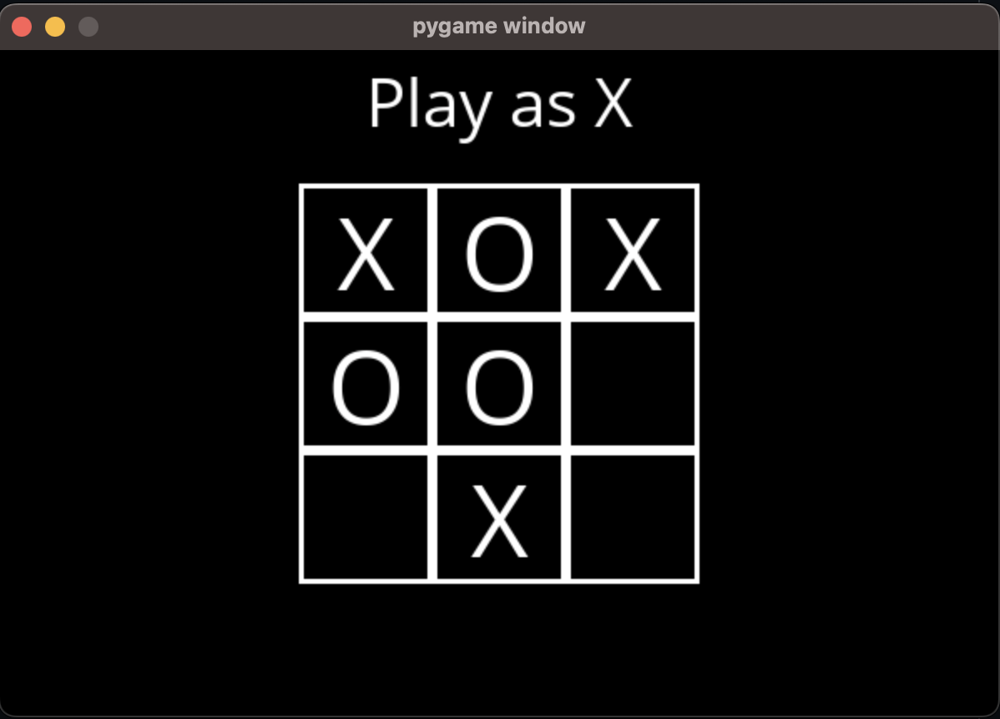

# Minimax AI Player

This repository contains two separate implementations of the Minimax algorithm in games: Chess and Tic-Tac-Toe. Both games are interactive and allow the user to play against an AI opponent powered by the Minimax algorithm.

## Contents

- `chess/`
  - `requirements.txt`
  - `main.py`
- `tictactoe/`
  - `requirements.txt`
  - `main.py`

## Installation

To run these games, you need to have Python installed on your system. Additionally, each game has its own set of dependencies which can be installed using `pip`.

### Chess

Navigate to the `chess` directory and install the requirements:

```bash
cd chess
pip install -r requirements.txt
```

### Tic Tac Toe

Navigate to the `tictactoe` directory and install the requirements:

```bash
cd tictactoe
pip install -r requirements.txt
```

## Usage
To play the games, run the `main.py` file in the respective game directory.


## Minimax Algorithm
The Minimax algorithm is a decision-making AI algorithm used in decision making and game theory. It provides an optimal move for the player assuming that the opponent is also playing optimally. In the case of Tic Tac Toe, this is not as complex, as the AI can recursively iterate through the upcoming moves playing optimally, and backtrack to a move on the current board that maximizes the optimal moves that would be made by the oponents. The AI always assumes the opponent player will minimize the possible score on its move, and recursively take the max of the mins of the max etc. until reaching the terminal boards where it is given the score of 1 if 'X' wins, -1 if 'O' wins and 0 for draw. The 'X' player will always maximize their score while the 'O' player is always minimizing their score. 


### Depth-Limited
The algorithm is much more time consuming on a game like chess with many more possibilities of moves and boards. The modification I made to this is using Depth Limited Minimax, where the recursion only goes to a parameter depth. This parameter will determine how many future plays the AI will look ahead to, in other words the skill level of the AI. This will take less memory and time to computer a meaningful move in chess. The score at the max depth recursive call will be determined by the material of the player adding up their pieces by weight and subtracting it from the opponents pieces by weight.


## Screenshots

### Chess


### Tic-Tac-Toe



